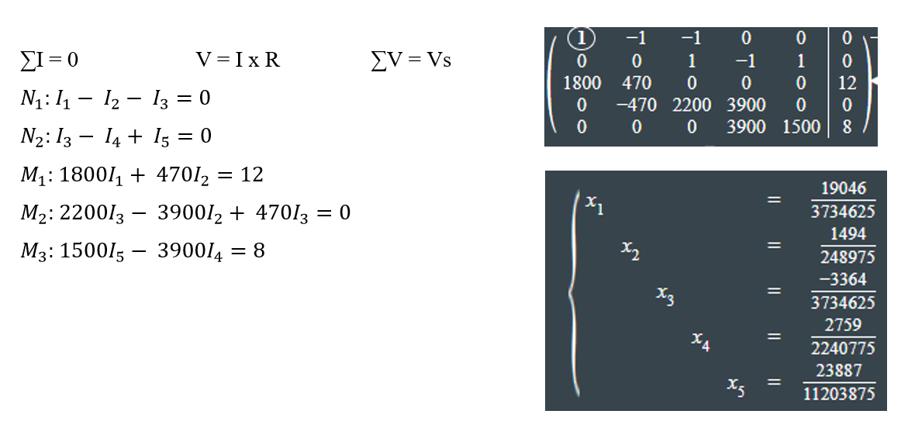

# Laboratorio-3

1. OBJETIVO GENERAL 

    OBJETIVOS ESPECIFICO 
    
2. MARCO TEÓRICO

3. EXPLICACIÓN DEL PROCEDIMIENTO

Circuito Analítico

Circuito Simulado

4. RESPUESTA A INTERROGANTES Y CALCULO DEL ERROR

Tabla 3.1. Resultados obtenidos para el circuito de la figura 3.1.

5. VIDEO

6. CONCLUSIONES

7. BIBLIOGRAFÍA
